# **Blog Platform with AI-Ready Features And Modifications As Part Of Our SRE Course (Modifications Are Also Demonstrated Via Screenshots In The Report That I Have Provided In Google Drive)**

An intuitive and modern blog publishing platform built using **Django**, featuring user authentication, post creation, comments, likes, bookmarks, notifications, analytics dashboard, user profiles, and a polished UI.  
The system includes **AI-ready modules** for semantic search and SEO generation, which can be activated using an OpenAI API key.

This project focuses on clean design, full-stack development, and scalable architecture — ideal for bloggers, students, and content creators.

---

## 🚀 **Key Features**

### **✔ Fully Implemented Features**
- **User Authentication**
  - Login, Signup, Logout  
  - Password reset via email  
- **User Profiles**
  - Avatar upload  
  - Bio, website, location  
  - View personal posts and bookmarks  
- **Create & Manage Blog Posts**
  - Rich text editor  
  - Upload cover image + gallery  
  - Category & tags  
  - Post editing, deleting  
- **Engagement Features**
  - Like, Bookmark, Comment  
  - Share post (copy link, share on X)  
- **Search & Filter**
  - Filter by category, author, tag  
  - Title/content-based search  
- **Notifications**
  - Receive alerts for comments & bookmarks  
- **Analytics Dashboard**
  - Total views  
  - Likes received  
  - Comments  
  - Bookmarks  
  - Top viewed posts  
- **Admin Panel**
  - Manage users, posts, categories, tags  
  - Moderate comments and notifications  

---

## 🤖 **AI-Ready Features (Planned / Requires API Key)**

These features are fully designed and **UI-ready**, but require integration with the OpenAI API:

| Feature | UI Status | Backend | Notes |
|--------|-----------|---------|-------|
| **Semantic Search** | ✔ Ready | 🚧 Requires embeddings | Searches posts by meaning, not keywords |
| **AI SEO Metadata Generator** | ✔ Ready | 🚧 Requires API | Auto-generate SEO title, description, tags |
| **AI Category & Tag Suggestion** | ✔ Ready | 🚧 Requires API | Suggests categories & tags based on content |
| **AI Content Summary** | ✔ Ready | 🚧 Requires API | Auto-generates post summaries |

> Enable these by adding your OpenAI API key later.

---

## 🛠 **Tech Stack**

- **Backend:** Django, SQLite / PostgreSQL  
- **Frontend:** HTML, CSS, Bootstrap  
- **AI:** OpenAI embeddings  
- **Authentication:** Django auth system  
- **Storage:** Local media storage  
- **Deployment:** Render/Railway (planned)

---

## 📂 **Project Structure**

blog-platform/
│── blog/ # Main blog application
│ ├── migrations/
│ ├── templates/blog/
│ ├── static/blog/
│ ├── models.py
│ ├── views.py
│ ├── forms.py
│ ├── urls.py
│ └── admin.py
│
│── blog_platform/ # Project configuration
│ ├── settings.py
│ ├── urls.py
│ └── wsgi.py
│
│── media/ # Uploaded images
│── staticfiles/ # Collected static assets
│── templates/ # Global templates
│── manage.py
│── requirements.txt
│── .gitignore

---

# 📸 **Screenshots**

Visual walkthrough of the platform:

## 🏠 Homepage  
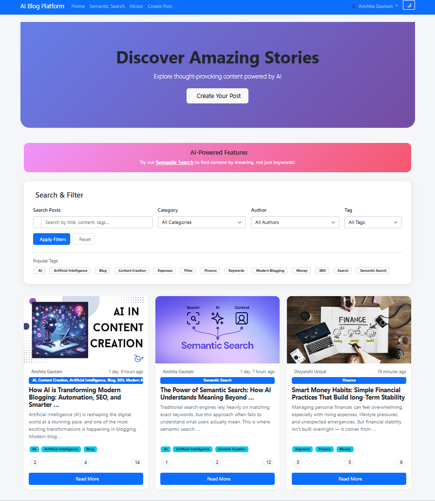

## 📰 Blog Post View  
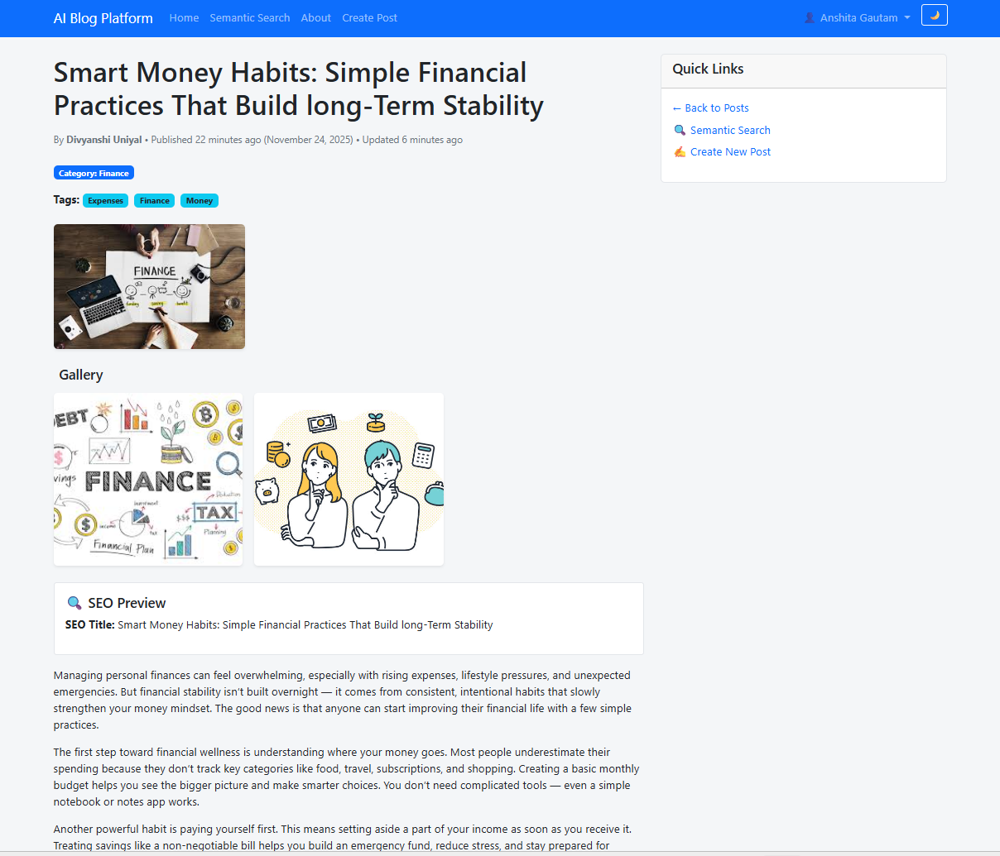

## ✍️ Create New Post  
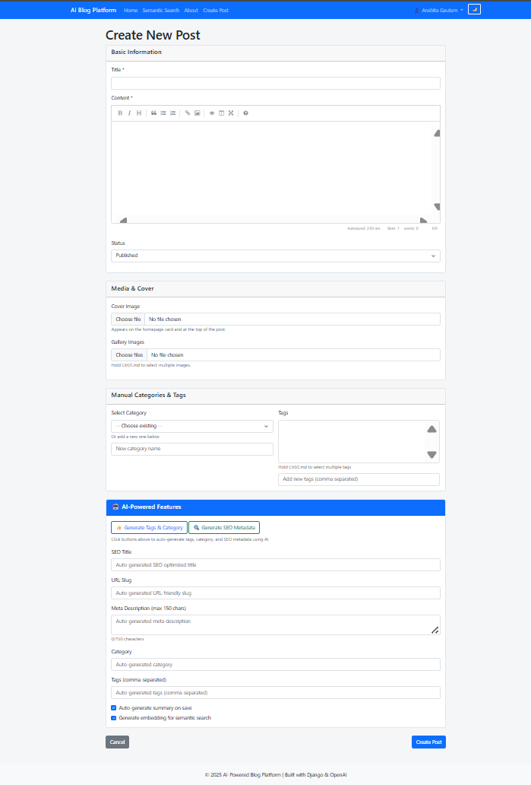

## 🧠 AI Semantic Search  
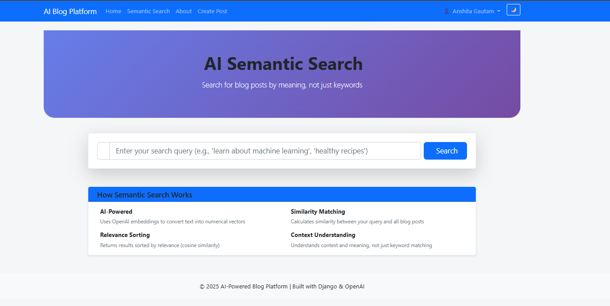

## 🔍 Search & Filter  
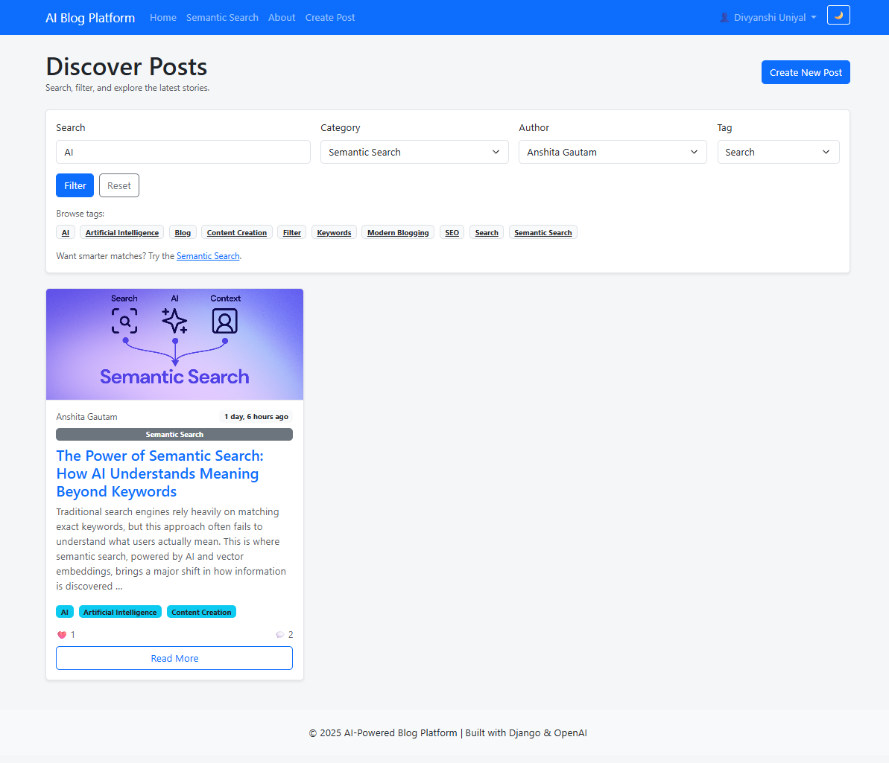

## 👤 Profile Page  
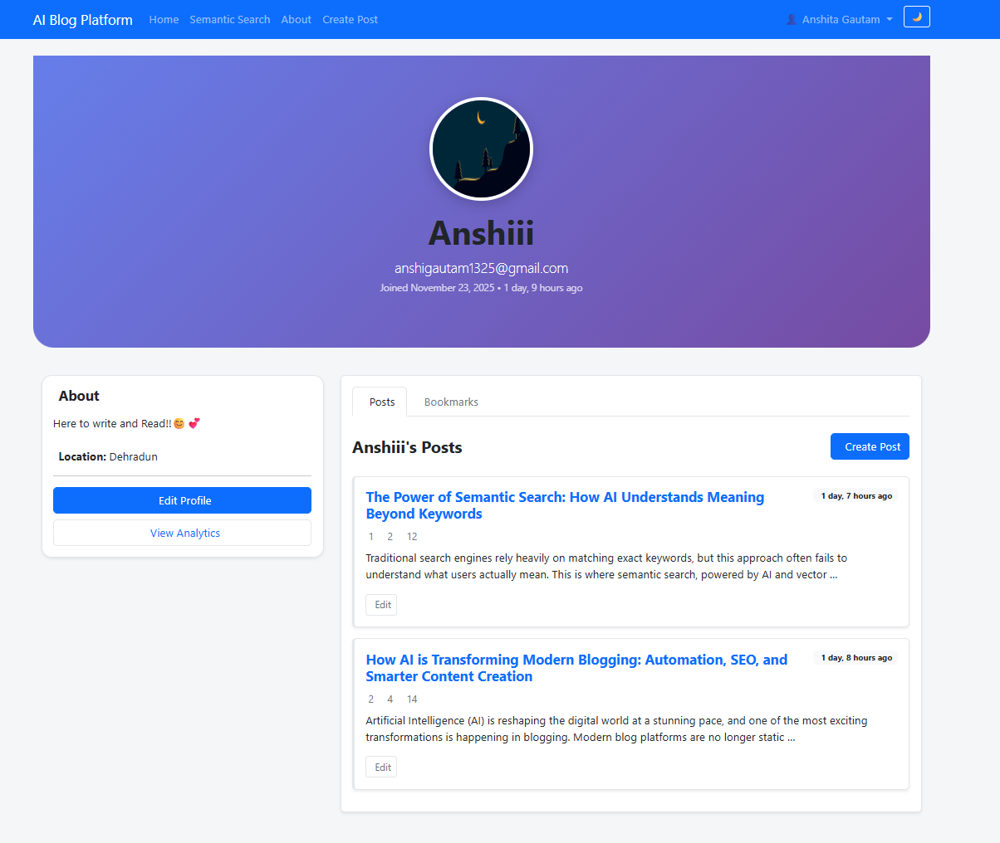

## 📝 Edit Profile  
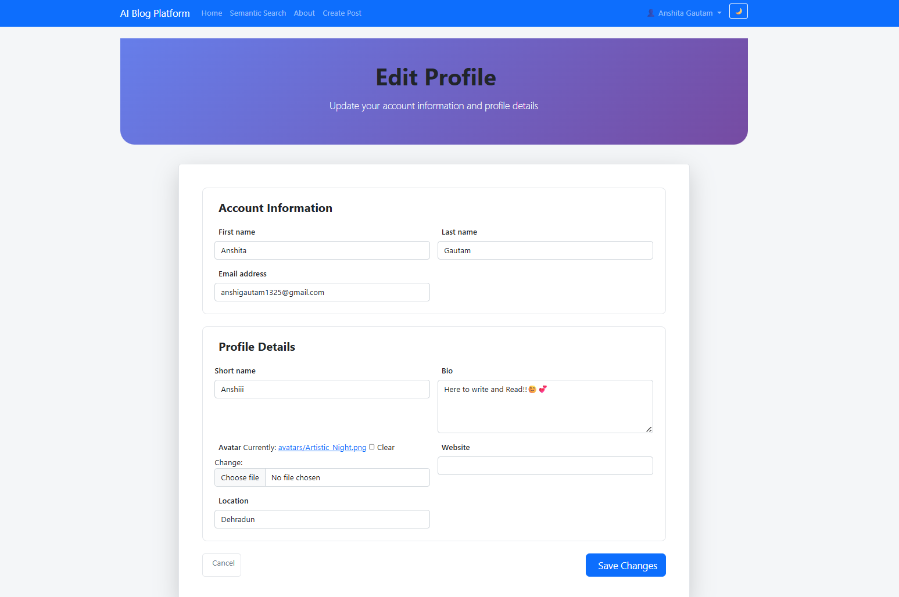

## 🔔 Notifications  
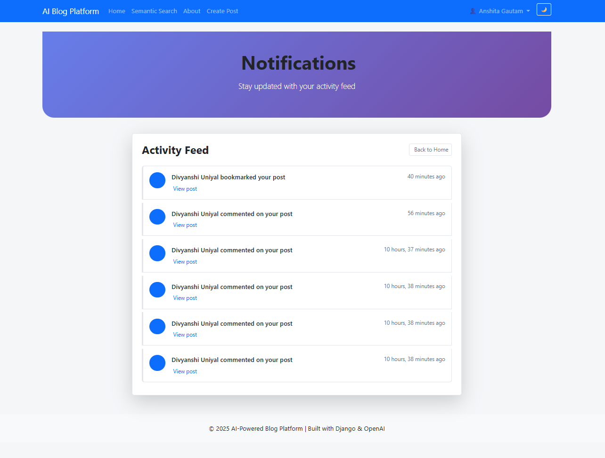

## 📊 Analytics Dashboard  
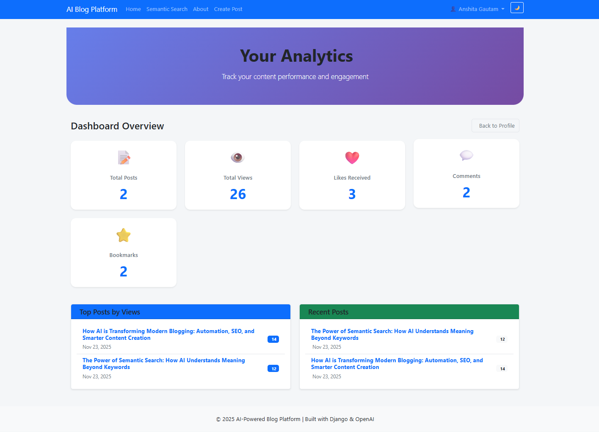

## ⚙️ Admin Panel  
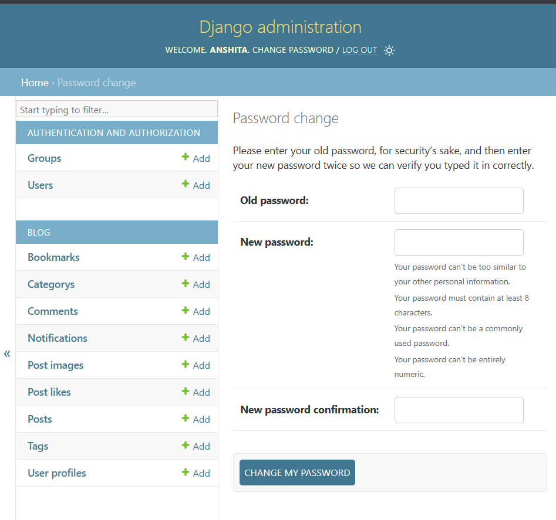

## 📄 Features Overview  
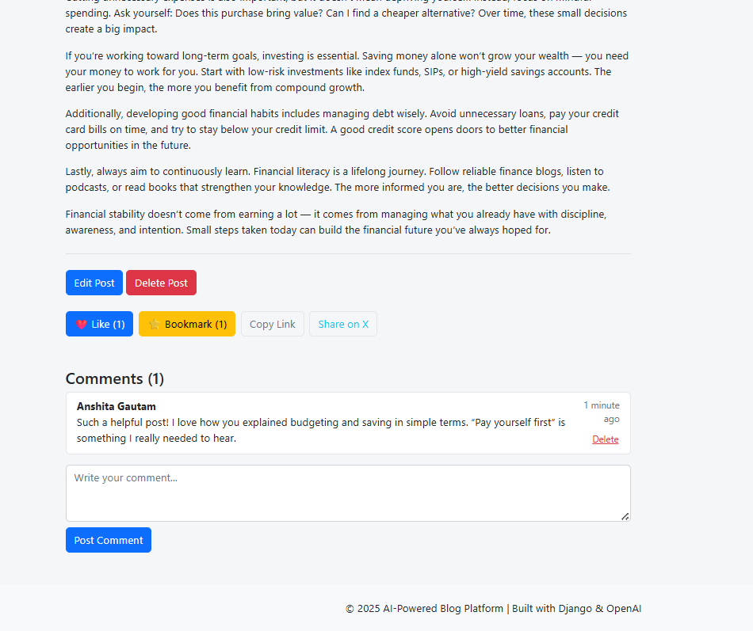

## 📘 About Page  
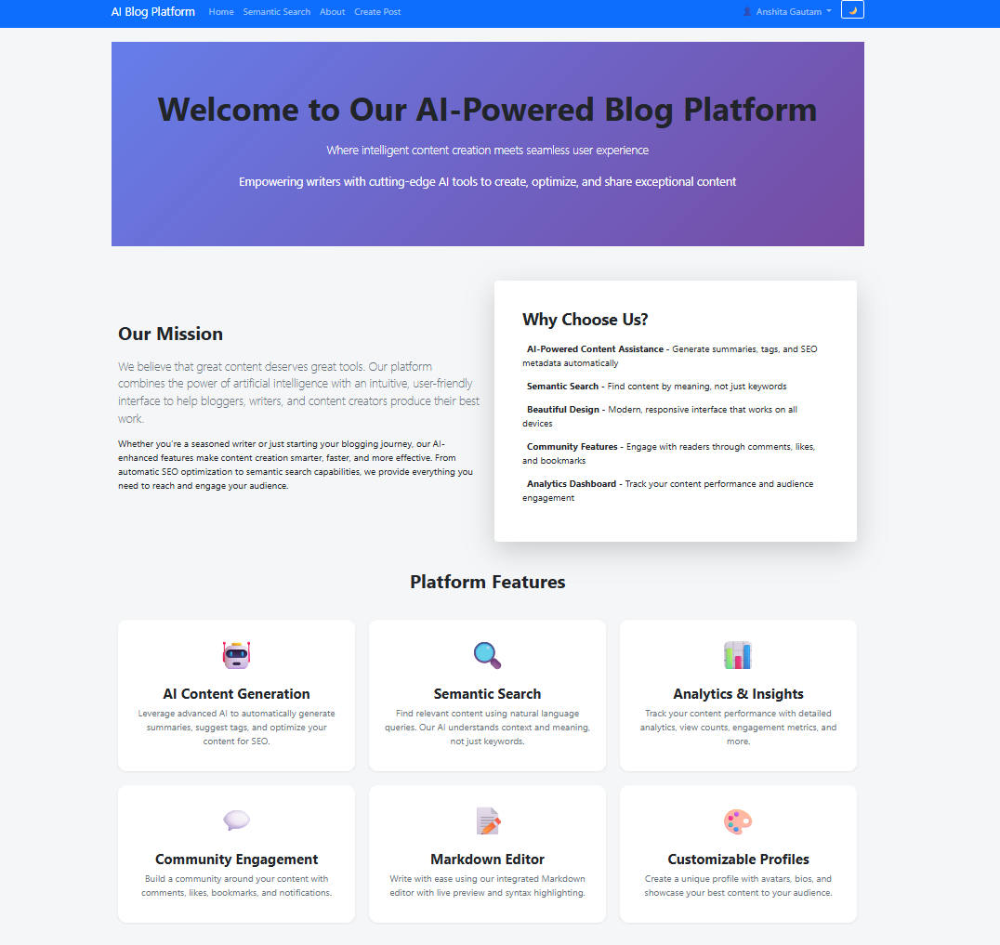

## 🔐 Login  
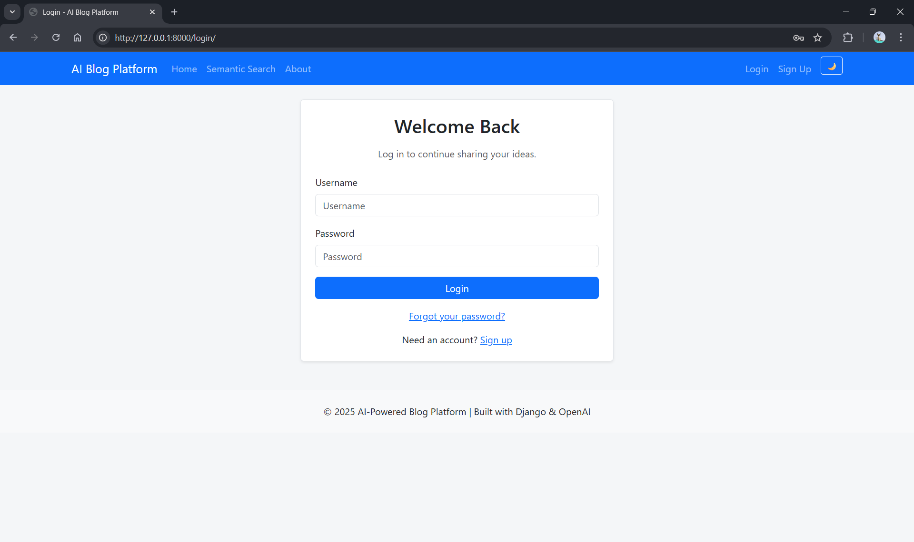

## 🆕 Register  
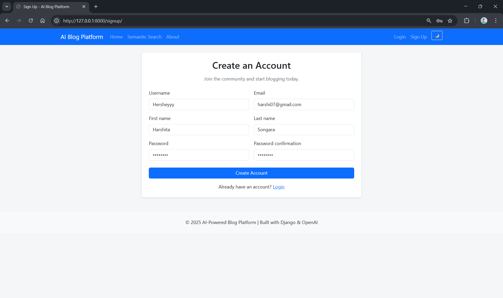

---

## ⚙️ **Installation & Setup**

### 1️⃣ Clone the repository

git clone https://github.com/Anshi1310/blog-platform.git

cd blog-platform

### 2️⃣ Create and activate virtual environment

python -m venv venv
source venv/Scripts/activate   # Windows

### 3️⃣ Install dependencies

pip install -r requirements.txt

### 5️⃣ Run the server

python manage.py runserver

---

## 🚀 **Future Improvements**

Integrate OpenAI API for:

Semantic Search

SEO Metadata Generation

AI Tag & Category Suggestions

AI Summaries

Add dark mode

Post scheduling system

Followers & personalized feeds

Email notifications

Deployment on Render/Railway

Switch database to PostgreSQL for production

---

## 📄 **License**

This project is licensed under the MIT License.

---

## 👩‍💻 **Original Author**

Anshita Gautam
Aspiring Web Developer | Python & Django | Frontend Enthusiast

GitHub: https://github.com/Anshi1310
